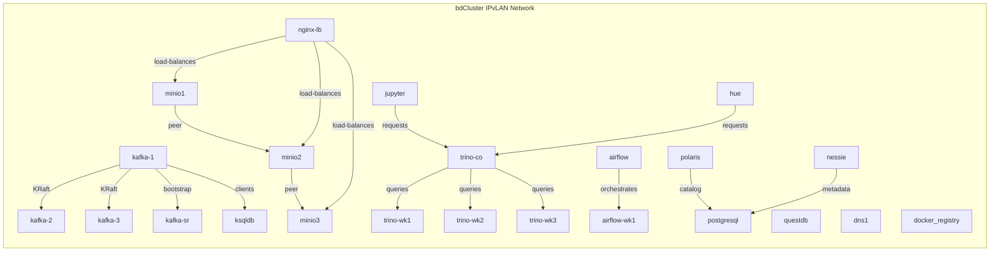

# Infra

A containerized big-data infrastructure repository for a self-hosted development and testing environment.

The stack is organized as multiple Docker Compose projects that share a common external IPvLAN network (`bdCluster`) and a common configuration file (`common.yml`).

---

## Architecture Overview

This repository defines a modular data platform with the following capabilities:

- Kafka streaming cluster with Schema Registry and ksqlDB
- Trino distributed SQL query engine
- MinIO object storage cluster with NGINX load balancer
- Airflow orchestration cluster with scheduler and worker nodes
- PostgreSQL and QuestDB persistence
- Metadata services: Apache Polaris, Project Nessie
- User interface services: Hue, Jupyter notebooks, Kafka UI
- Utility services: local Docker registry, PyPI server, Redis, Bind9 DNS

The environment is designed around a dedicated private network and fixed hostnames under `bdc.home`.

---

## Repository Layout

- `common.yml` - shared service definitions and common configuration for Kafka, Spark, Airflow, and other base images.
- `airflow/` - Airflow compose definitions and image build logic.
- `db/` - PostgreSQL and QuestDB containers.
- `kafka/` - Kafka KRaft cluster topology and streaming components.
- `minio/` - MinIO distributed object store plus load balancer and CLI container.
- `trino/` - Trino coordinator and worker nodes.
- `interface/` - Data interface services including Hue and Jupyter.
- `ext_serv/` - Supporting external services such as DNS, registry, PyPI, Redis, and Kafka UI.
- `catalog/` - Metadata and catalog services, including Polaris and Nessie.
- `.env` - environment variables used by Compose files.

---

## Key Concepts

### Private Network

All Docker Compose projects attach to an external Docker network named `bdCluster`.

- driver: `ipvlan`
- subnet: `192.168.1.0/24`
- gateway: `192.168.1.1`
- parent interface: `${ETHERNET_NAME}` from `.env`

This allows containers to use static IPs and predictable hostnames.

### Hostnames

The deployment expects container hostnames such as:

- `kafka-1.bdc.home`
- `postgresql.bdc.home`
- `minio1.bdc.home`
- `trino-co`
- `airflow`
- `jupyter.bdc.home`

These hostnames are configured in Compose files and should be resolvable by DNS or `/etc/hosts` in your environment.

---

## Service Groups

### Streaming & Messaging

- `kafka/` - 3-node Kafka cluster using KRaft mode
- `kafka-sr` - Confluent Schema Registry
- `ksqldb` - KSQL DB server

### Storage & Catalog

- `minio/` - 3-node MinIO cluster with `nginx-lb`
- `catalog/` - Polaris and Nessie metadata/catalog services

### Compute

- `trino/` - distributed query engine with coordinator and workers
- `airflow/` - Airflow webserver and worker pool
- `spark/` - Spark image definition and config

### Data Persistence

- `db/` - Postgres and QuestDB containers for OLTP and timeseries storage

### Interface & Utilities

- `interface/` - Hue, Jupyter notebooks
- `ext_serv/` - DNS, local registry, PyPI server, Redis, Kafka UI

---

## Environment Variables

The `.env` file defines important runtime values such as:

- `ETHERNET_NAME` - host NIC used by `ipvlan`
- `LOCAL_DIR` / `HOST_DIR` - local mount path prefixes
- `DOCKER_USR` / `DOCKER_PASS` - shared credentials
- `MINIO_ENDPOINT` - MinIO access endpoint
- versions for Airflow, Kafka, Trino, Spark, Nessie, etc.

> Update `.env` before starting the stack to match your local host environment.

---

## Getting Started

1. Ensure the external Docker network exists:

```bash
docker network create -d ipvlan \
  --subnet=192.168.1.0/24 \
  --gateway=192.168.1.1 \
  --ip-range=192.168.1.0/24 \
  -o parent=${ETHERNET_NAME} bdCluster
```

2. Export environment variables from `.env` if your shell does not automatically load them:

```bash
set -a
source .env
set +a
```

3. Start a service group, for example Kafka:

```bash
docker compose -f kafka/docker-compose.yml up -d
```

4. Start MinIO:

```bash
docker compose -f minio/docker-compose.yml up -d
```

5. Start the rest of the stack in the order you need it.

---

## Example Startup Order

1. `db/docker-compose.yml`
2. `minio/docker-compose.yml`
3. `kafka/docker-compose.yml`
4. `trino/docker-compose.yml`
5. `airflow/docker-compose.yml`
6. `interface/docker-compose.yml`
7. `ext_serv/docker-compose.yml`
8. `catalog/docker-compose.yml`

---

## Architecture Diagram

### Topology


```

### Data Flow Example

```mermaid
graph TD
  A[Airflow DAG / Spark Job] -->|writes| MinIO[MinIO]
  A -->|produces| Kafka[Kafka Cluster]
  Kafka -->|streams| KSQLDB
  B[Trino] -->|reads| MinIO
  B -->|reads| Kafka[via connector]
  B -->|joins| Postgres
  C[Hue / Jupyter] -->|queries| Trino
  D[Nessie] -->|manages| Data Catalog
  E[Polaris] -->|governs| Trino / Spark
```
```

---

## Notes

- Hostnames and IPs are fixed in Compose files. Adjust addresses and network settings carefully for your environment.
- `ext_serv/` services such as `dns1`, `registry`, and `pypi-server` use `network_mode: host` and may require host port availability.
- The MinIO stack exposes `9000`/`9001` through `nginx-lb`.

## References

- `common.yml` contains shared image and environment settings used by multiple service groups.
- `.env` contains all version pins and credentials.
- `spark/`, `airflow/`, `trino/`, `catalog/`, `minio/`, and `db/` folders contain service-specific compose definitions and config.

---

## License

No license file is included in this repository by default. Add one if required.
